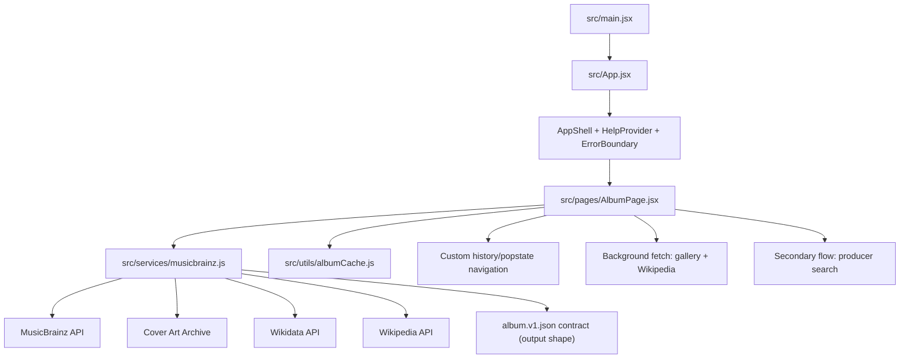

# Liner Notez

Liner Notez is a React/Vite web app for album-first music metadata exploration. Users can search by artist (primary flow) or producer (secondary flow), browse album results, and open detail pages that surface tracklists, credits, editions, cover art, and contextual Wikipedia summaries sourced from public music data APIs.

## Live Demo

- [https://vibey-liner-notez.vercel.app](https://vibey-liner-notez.vercel.app)

## Core Features

- Album search by artist with optional album name and release-type filtering
- Producer search via MusicBrainz relationship traversal (secondary flow)
- Result list sorting, pagination, and bootleg filtering
- Album detail view with credits, tracklist, and editions
- Background loading for gallery images and Wikipedia summary with retry/error states
- Browser-history-driven back navigation across search, results, and album detail states

## Architecture Overview

- App entry: `src/main.jsx`
- Top-level composition: `src/App.jsx` (`ErrorBoundary`, `HelpProvider`, `AppShell`, `AlbumPage`)
- Primary UI/state controller: `src/pages/AlbumPage.jsx`
- Service layer: `src/services/musicbrainz.js`
- Client caching: `src/utils/albumCache.js`
- Data contract: `album.v1.json` (target schema for assembled album objects)

## Architecture Diagram



## Development / Local Setup

```bash
npm install
npm run dev
```

- Default Vite dev URL is typically `http://localhost:5173`

## Testing

```bash
# Run full test suite
npm run test:run

# Open Vitest UI
npm run test:ui
```

Test files are under `src/**/__tests__` and cover app regression, page flows, service behavior, utilities, and error boundaries.

## Data Sources and Schema Contract

- Music metadata source: MusicBrainz API
- Cover images: Cover Art Archive
- Encyclopedia context: Wikidata -> Wikipedia
- Assembled album objects are shaped to the `album.v1.json` contract
- Project docs and service code emphasize no data invention; missing fields are treated as unavailable data
